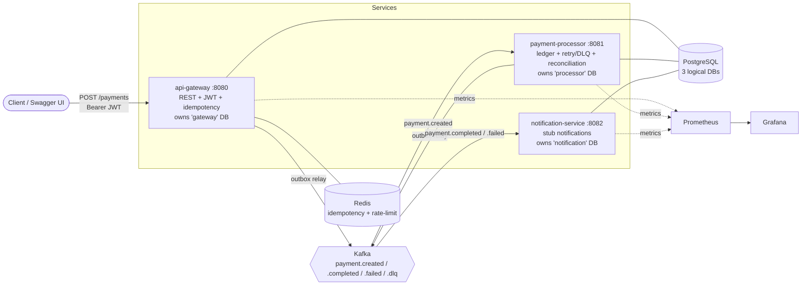
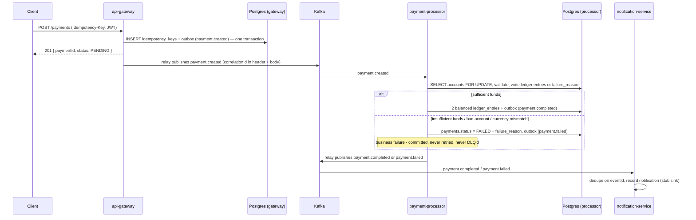

# payment-gateway-simulator

A **payment gateway simulator** — idempotent payment initiation, an event-driven ledger over
Kafka, the transactional outbox pattern, ACID double-entry bookkeeping, retry/DLQ with
business-vs-infra error classification, reconciliation, and correct multi-currency money handling
(including **JPY's zero-decimal exponent**, the detail most demo projects get wrong).

This is a **simulator**: no real payment rails, no real money movement, no FX conversion, no real
KYC/fraud checks. It exists to demonstrate the backend patterns a fintech (this project is framed
around a PayPay-style Japanese fintech role, see [How this maps to the role](#how-this-maps-to-the-role))
actually runs in production.

## 60-second quickstart

```bash
git clone <this-repo>
cd payment-gateway-simulator
docker compose up
```

That single command brings up all 3 services, Postgres, Kafka, Redis, Prometheus, and Grafana —
nothing else, no cloud account, no paid API key, no manual DB setup. Demo accounts (two JPY, one
USD) are seeded automatically.

Then, in another terminal:

```bash
./demo.sh
```

`demo.sh` fires three real payments against the running stack — a JPY happy path, a duplicate
`Idempotency-Key` replay, and an insufficient-funds failure — and prints exactly what happened,
including a reconciliation check. Nothing in its output is asserted blind: every status comes back
from the actual services.

Or explore by hand:
- **Swagger UI**: http://localhost:8080/swagger-ui — call `POST /auth/token` for a demo JWT,
  click **Authorize**, paste it in, then try `POST /payments`.
- **Grafana**: http://localhost:3000 — a pre-provisioned "Payments" dashboard (throughput,
  success/fail rate, p99 latency, DLQ message count). Nice-to-have: everything else works without it.

### A JPY payment, end to end

```bash
TOKEN=$(curl -s -X POST http://localhost:8080/auth/token | sed -E 's/.*"token":"([^"]+)".*/\1/')

curl -X POST http://localhost:8080/payments \
  -H "Authorization: Bearer $TOKEN" \
  -H "Idempotency-Key: $(uuidgen)" \
  -H "Content-Type: application/json" \
  -d '{"fromAccount":"jpy-funded","toAccount":"jpy-low","amount":"1000","currency":"JPY"}'
```

`amount` is a **string**, always — `"1000"`, never `1000.00`. JPY has zero decimal places; sending
`"1000.00"` for a JPY payment returns `400 INVALID_AMOUNT_SCALE`. This is validated per
[ISO 4217](https://en.wikipedia.org/wiki/ISO_4217) minor-unit exponent, not hardcoded to JPY —
USD (2 decimals) and other currencies are handled by the same rule.

## Architecture



Each service owns its own logical database (one Postgres container, three databases — logical
isolation at zero extra infrastructure cost) and never reads or writes another service's tables.
`api-gateway` never touches the ledger; only `payment-processor` does. State crosses service
boundaries only via Kafka events, never direct DB or in-process calls.

## Sequence: a payment from request to settled



The gateway's `POST /payments` returns before the ledger transaction runs — that's the point of
the outbox/Kafka split: the HTTP response measures **request-acceptance** latency, not
**end-to-end settlement** latency. Keep that distinction in mind when reading the throughput
numbers below.

## Idempotency & the outbox, briefly

- **Idempotency** is two-layer: Redis is the fast path, Postgres is the source of truth. The same
  `Idempotency-Key` with the same body always replays the original response; the same key with a
  **different** body returns `409` (Stripe's behavior). A concurrent duplicate resolves via
  Postgres's primary-key constraint — the loser re-reads the winner's row, never double-processes.
- **The outbox pattern** removes the classic dual-write bug (publish to Kafka *and* write the DB,
  where one can succeed while the other fails). Both `api-gateway` and `payment-processor` write
  their event to an `outbox` table in the **same transaction** as their business write; a small
  poller relays unpublished rows to Kafka. An event is emitted **if and only if** its transaction
  committed.

## Retry, DLQ, and reconciliation

Only **infrastructure** failures (a transient DB error, a poison/malformed message) go through
retry-then-DLQ (`payment.created.dlq`, exponential backoff, 3 total attempts). A **business**
failure — insufficient funds, unknown account, currency mismatch — is a normal, committed outcome:
`payment.failed` is emitted, nothing is retried, nothing lands in the DLQ. This classification is
the actual interview-relevant design decision, not the retry loop itself.

`GET :8081/reconciliation` answers "how would you detect a stuck or lost payment": it reports any
`COMPLETED` payment without exactly two matching ledger entries, any consumed `payment.created`
with no `payments` row, any global debit/credit imbalance, or any account balance that doesn't
match its seed plus net ledger movement. An empty array means the books balance.

## Load test: honest local-laptop numbers

Run it yourself: `bash load-test/run.sh` (needs Docker only — it runs [k6](https://k6.io/) in a
container against the stack, then verifies idempotency by querying Postgres directly).

| Metric | Result |
|---|---|
| Concurrency | 10 VUs, 30s, unique `Idempotency-Key` per request |
| Throughput | ~1,840 req/s |
| p90 / p95 / p99 latency | ~5.2ms / ~5.6ms / ~7.5ms |
| HTTP failures | 0% across ~64,500 requests |
| Idempotency under load | 20 concurrent requests sharing one `Idempotency-Key` → exactly 1 row in `idempotency_keys`, confirmed via direct Postgres query |

**Read this honestly.** This is a single docker-compose stack on one laptop, not a benchmark of
anything larger, and it measures **request-acceptance** throughput (the gateway's idempotency
check + outbox insert) — not end-to-end ledger-settlement throughput, since that happens
asynchronously after the HTTP response per the outbox/Kafka split above. The point of this artifact
isn't the number; it's the methodology — a repeatable, scriptable load test that also proves a
correctness property (idempotency) under real concurrency, not just raw req/s.

## Security

`POST /payments` requires a JWT (`POST /auth/token` mints a demo one — dev-only, pre-fillable via
Swagger's Authorize button). `api-gateway` also rate-limits `/payments` via a Redis fixed-window
counter (`429` past the configured threshold). Gitleaks and Trivy scan every CI run.

## Observability

Every service exposes Actuator + a Prometheus registry; Grafana comes pre-provisioned with a
"Payments" dashboard. A `correlationId` is generated once per request at `api-gateway`, carried in
the Kafka message header, and read into MDC by every consumer — one payment's logs are traceable
by that single ID across all three services' structured JSON logs.

## Optional / not built (documented as clean add-ons, not gaps in the design)

- **Refund flow** — a reverse payment (DEBIT/CREDIT swapped) referencing the original `paymentId`;
  reuses the ledger and outbox unchanged.
- **Real webhook delivery** — `notification-service` already dedupes and would retry; swapping the
  stub sink for an HTTP webhook needs no new discipline.
- **Read-only admin views** — `GET /payments/{id}` and a `GET /reconciliation` proxy on
  `api-gateway` aren't built; query `payment-processor` directly (`:8081/reconciliation`) or the
  `processor` DB in the meantime.
- **Kubernetes deploy demo** — `k8s/deploy.sh` stands the whole stack up on a local
  [`kind`](https://kind.sigs.k8s.io/) cluster (same zero-cost approach as this project's
  companion, distributed-auth-platform) and is exercised on every CI run. It's a talking point for
  cloud-readiness, never a runtime requirement — `docker compose up` is always the primary way to
  run this project.
- **AWS parity** (talking point, not a dependency): the compose services map 1:1 onto RDS
  (Postgres), ElastiCache (Redis), MSK (Kafka), and EC2/EKS (the three services) — the
  architecture is cloud-shaped without requiring a cloud account to try it.

## How this maps to the role

This project is built against what a PayPay-style backend role actually asks for:

| JD language | Where it lives here |
|---|---|
| "RESTful APIs" | `api-gateway`'s `POST /payments`, OpenAPI/Swagger on every service |
| "Pub/Sub systems" | Kafka topics (`payment.created`/`.completed`/`.failed`/`.dlq`), keyed by `paymentId` for per-payment ordering |
| "Design large-scale systems to support high throughput" | Load-test methodology above — honest numbers, not a marketing claim, plus an architecture (outbox + async ledger) that's built to scale the write path independently of settlement |
| "Idempotency and distributed transactions" | Two-layer idempotency (§ above), the transactional outbox, ACID double-entry ledger |
| Correct multi-currency handling | JPY zero-decimal exponent validated and enforced at the API boundary, not just in the DB |

Same JVM/Spring/Kafka/PostgreSQL/Redis stack a Japanese fintech backend team runs in production.

## Tech stack

| Concern | Choice |
|---|---|
| Language / runtime | Java 21 |
| Framework | Spring Boot 3.4 |
| Build | Gradle (Kotlin DSL), one module per service |
| Messaging | Kafka (KRaft, single broker) |
| Database | PostgreSQL 16, 3 logical databases |
| Cache / counters | Redis 7 |
| Auth | JWT (Spring Security resource server) + a demo-token dev endpoint |
| Observability | Micrometer + Prometheus + Grafana, structured JSON (ECS) logs |
| CI | GitHub Actions — build/test, E2E (Testcontainers), Gitleaks, Trivy, a `kind` deploy smoke test |

See [`docs/DESIGN.md`](docs/DESIGN.md) for the full design — schemas, event contracts, ID
semantics, and the phase-by-phase build log this project followed.
